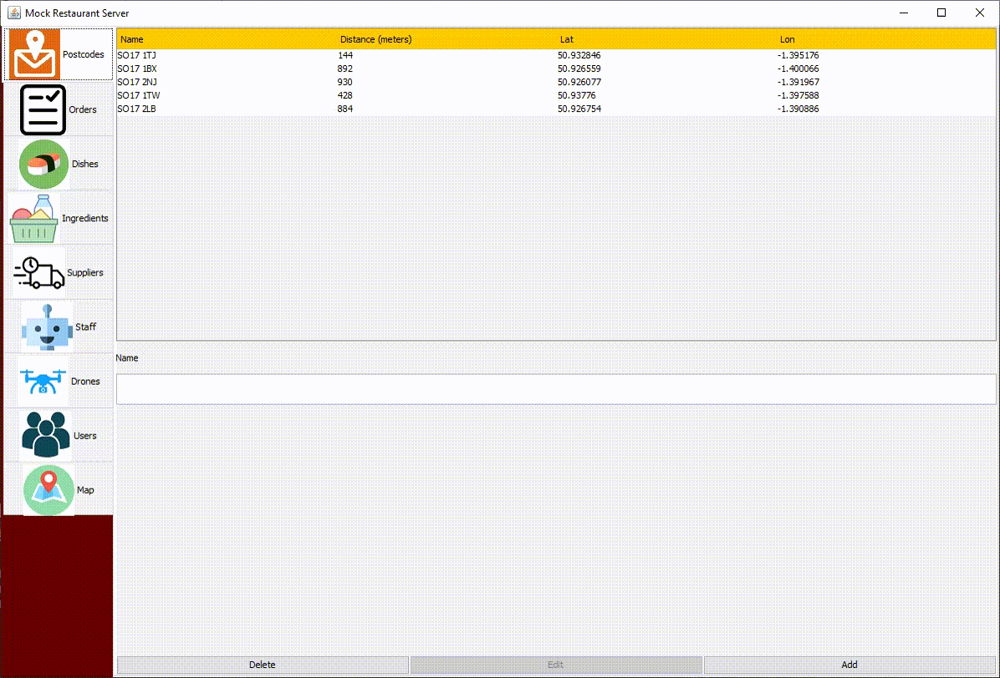

# Sushi restaurant
This is a representation of a sushi restaurant server UI.\
This project was completed with: [Swing](https://docs.oracle.com/javase/7/docs/api/javax/swing/package-summary.html), Java



## Running
The program can be run from: src/comp1206.sushi/ServerApplication.java
```
javac ServerApplication.java
java ServerApplication
```
## Developed by
Martin Kanev - m.kanev99@gmial.com
